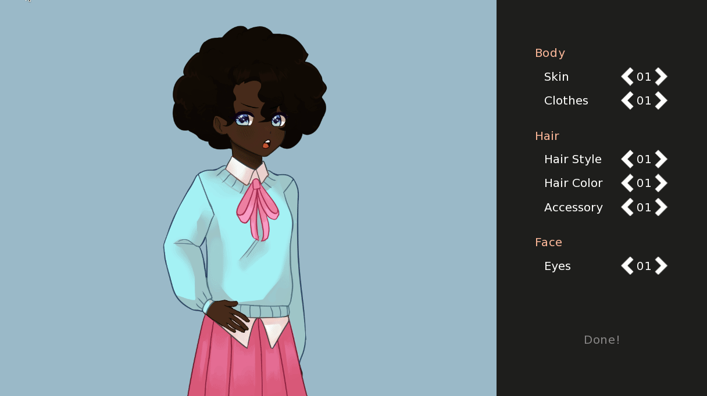

= Ren'Py Character Customizer

A pluggable character sprite customization framework that allows the creation of
any number of customized and runtime customizable sprites using Ren'Py's
``LayeredImage``s.

This project is currently in its early stages so, while it works fine, the
included ``screen``s are not the prettiest.  Luckily this framework provides the
tools necessary to customize those ``screen``s.

== Preview

== Credits

=== Resources Used

* Example Sprite Layers - link:https://butterymilk.itch.io/awfully-sweet[Butter Milk on Itch.io]

=== Contributors

Foxcapades::
image:docs/assets/github.svg[width=32, link="https://github.com/Foxcapades"]

GemmySystem::
image:docs/assets/github.svg[width=32, link="https://github.com/GemmySystem"]
